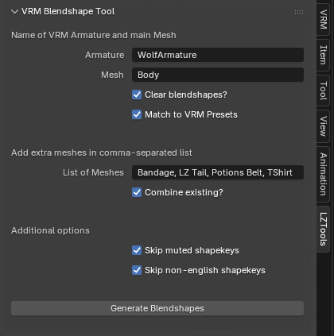

# LZ's VRM Blendshape Tool for blender

Simple tool to assist with your VRM model for quickly generating blendshape proxies from your meshes shapekeys.
Tool will appear along the right sidebar menu under "LZTools" when you are in Object Mode.

Requires [VRM Add-on for Blender](https://vrm-addon-for-blender.info/en-us/)

## Installation:
- Download the latest zip under the *releases* folder or https://github.com/Lunazera/Blender-VRM-Blendshape-Tool/releases
- Drag the zip file into blender, and accept to install.
- or, under Edit > Preferences > Add Ons, click the top right button to install from disk and install the zip file

## How To Use:
1. Put in the name of your VRM *Armature* and main *Mesh* into the textboxes
2. Toggle *Clear Blendshapes* if you want to clean the existing blendshape proxies on your model
3. Add extra meshes in the *List of Meshes* textbox as a comma-separated list if you want to also generate from other meshes. (For example, `Shirt, Bandage, Pants`)
4. Toggle *Combine Existing* if you want shapekeys to combine with existing blendshapes if they already exist.
5. Click *Generate Blendshapes* to run

## Features:
- Clear existing blendshape proxies before generating
- Combine similarly-named blendshapes from additional meshes
- Ignores blendshapes that are not written in english (japanese characters can break some programs)
- Reads the Mute status of shapekeys, and skips generating from muted (unchecked) shapekeys
- Name-matches preset VRM blendshapes (like 'neutral', 'a', 'i', 'o')

## TODO:
- Add toggle for "ignore muted shapekeys", "ignore non-english" and "match VRM presets"
